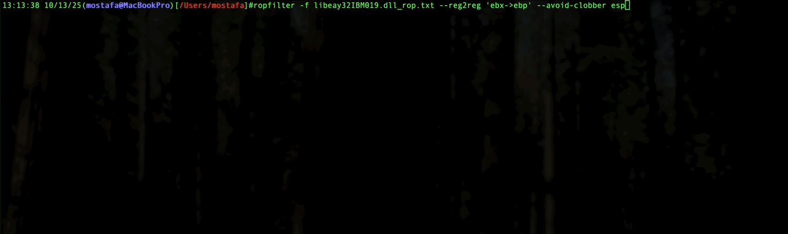

# 🧠 ropfilter  
**Advanced ROP Gadget Filtering & Chain Solver**

`ropfilter` is a powerful tool developed during my OSED course for filtering, ranking, and chaining ROP gadgets extracted from [`rp++`](https://github.com/0vercl0k/rp) dumps.  
It helps you quickly locate useful gadgets, build multi-step register chains, and even solve complex constraints through YAML/JSON specs.

---

## 🚀 Features
- 🔍 Smart gadget filtering by register transfers, memory operations, or arithmetic logic.  
- 🔗 Automated chain synthesis (`--chain`) when no single gadget satisfies the constraints.  
- 🧩 Constraint solver supporting JSON/YAML specifications (requires **PyYAML**).  
- 🧠 Stability & safety filters (`--safe-enable`) to automatically enforce robust ROP selection.  

---


## 🧩 Architecture Support

`ropfilter` currently supports **x86 (32-bit)** instruction sets only.  
All gadget parsing, register naming, and stack behavior analysis are based on 32-bit Intel syntax (`eax`, `ebx`, `esp`, etc.).

> 🧱 x64 support is planned for a future release — contributions or PRs extending decoding and register mapping are welcome!

---

## ⚙️ Installation

### Option 1 — Direct from GitHub (recommended)
```bash
pipx install "git+https://github.com/MostafaSoliman/ropfilter@main"
```

### Option 2 — Using pip (virtualenv)
```bash
python3 -m venv .venv
source .venv/bin/activate
pip install "git+https://github.com/MostafaSoliman/ropfilter@main"
```


**Dependencies:**  
- Python ≥ 3.9  
- `pyyaml>=6` (installed automatically)

---

## 🧩 Basic Usage

```bash
ropfilter -f libeay32IBM019.dll_rop.txt --reg2reg 'eax->ecx'
```

```bash
ropfilter --safe-enable --addr-no-bytes 0x00 -f libeay32IBM019.dll_rop.txt --reg2reg 'eax->ecx'
```

Example output:
```
0x1002f6fa # xchg eax, ecx ; nop ; add byte [eax], al ; add byte [eax+0x57], dl ; call edx
...
```

---

## 🧰 Core Options Overview

| Category | Flags | Description |
|-----------|-------|-------------|
| Input | `-f FILE` | Path(s) to rp++ gadget text file(s) |
| Addressing | `--base-addr`, `--addr-no-bytes` | Base address and bad byte filtering |
| Filters | `--max-instr`, `--retn`, `--ret-only`, `--protect-stack` | Instruction and stack safety |
| Register Ops | `--reg2reg` | Register transfers (e.g. `eax->ecx`) |
| Memory Ops | `--memread`, `--memwrite` | Memory reads/writes with displacement filters |
| Arithmetic | `--arith` | Arithmetic or logic operations |
| Stability | `--stable-dst`, `--stable-src`, `--strict-mem`, `--exact-reg` | Smart gadget validation |
| Chaining | `--chain`, `--chain-max-steps`, `--chain-limit` | Multi-gadget chain synthesis |
| Solver | `--solve-file`, `--solve-json` | Solve YAML/JSON constraints |
| Output | `--out`, `--limit`, `--best-last` | Control result ranking and format |
| Debug | `--debug`, `--debug-file` | Detailed trace output for analysis |

Run:
```bash
ropfilter --help
```
for the full command list.

---

## 🔬 Practical Examples

### 🔹 Register Transfers (`--reg2reg`)
**Find gadgets that move `eax` to `ecx`:**
```bash
ropfilter --best-last --safe-enable -f libeay32IBM019.dll_rop.txt --reg2reg 'eax->ecx'
```

**Find where `eax` can go to:**
```bash
ropfilter --best-last --safe-enable -f libeay32IBM019.dll_rop.txt --reg2reg 'eax->*'
```

**Find where `eax` can go except `ecx` and `edx`:**
```bash
ropfilter --best-last --safe-enable -f libeay32IBM019.dll_rop.txt --reg2reg 'eax->!ecx|edx'
```

---

### 🔹 Memory Reads (`--memread`)
**Find gadgets that read from `[eax+disp]` into `eax`:**
```bash
ropfilter --best-last --safe-enable -f libeay32IBM019.dll_rop.txt --memread 'base=eax,dst=eax,op=mov|pop|xchg,disp<=0x20'
```

**Find gadgets that read from memory pointed by `ecx`:**
```bash
ropfilter --best-last --safe-enable -f libeay32IBM019.dll_rop.txt --memread 'base=ecx'
```

---

### 🔹 Memory Writes (`--memwrite`)
**Find gadgets that write `eax` into `[ebp+disp]`:**
```bash
ropfilter --best-last --safe-enable -f libeay32IBM019.dll_rop.txt --memwrite 'base=ebp,src=eax,disp=0x04'
```

---

### 🔹 Arithmetic (`--arith`)
**Find `add`/`sub` between registers:**
```bash
ropfilter --best-last --safe-enable -f libeay32IBM019.dll_rop.txt --arith 'dst=eax,src=ecx,op=add|sub'
```

**Find gadgets that add `[eax]` to `edx`:**
```bash
ropfilter --best-last --safe-enable -f libeay32IBM019.dll_rop.txt --arith 'src_base=eax,dst=edx,op=add'
```

**Find gadgets performing `neg` or `xor`:**
```bash
ropfilter --best-last --safe-enable -f libeay32IBM019.dll_rop.txt --arith 'op=neg|xor'
```

---

## 🧮 Chaining Gadgets (`--chain`)

If no single gadget satisfies your filter, `--chain` automatically combines multiple gadgets to achieve the goal.
For Example, There is not single gadget that transfer ebx to ebp without modifing esp.

Example:
```bash
ropfilter -f libeay32IBM019.dll_rop.txt --reg2reg 'ebx->ebp' --avoid-clobber esp --chain 
```

Output:
```
[chain] synthesized candidate chains (best first):
0x1001ee9e -> 0x10035917
    mov eax, ebx ; pop ebx ; ret  ->  xchg eax, ebp ; ret
...
```




---

## 🗺️ Register Map (`--reg-map`)
Get a global overview of register reachability and possible transfers.

```bash
ropfilter -f libeay32IBM019.dll_rop.txt --reg-map 1 --chain
```

---

## 🧠 YAML Solver Example (`--solve-file`) 

ropfilter can read yaml file that define register variables that have set of constrains similar to the flags mentioned above, the tool will try to solve the register variables and detect what set of registers comply with all the defined constrains.

for example in typical rop chain we need a register that points to the VirtualAlloc skeleton, lets call it `base` we also need a register that can dereference memory location lets call it `func`. we need them to satisfy the following constrains:

1. reg2reg: esp->`base` and avoid modifying esp
2. reg2reg: `base`->esp
3. memread: base=`func`, dst=`func` and avoid modifying esp|`base`
4. memwrite: base=`base`, src=`func` and avoid modifying esp|`base`
5. `base` and `func` cannot be the same register
6. we need to be able to pop to `func`


This is useful in classic VirtualAlloc/VirtualProtect ROP setups where you need:
- a stack-based base pointer you can move around, and
- a function/deref register you can read from/write to memory.

This constrains can be translated to the following YAML file.

**File:** `spec.yaml`
```yaml
vars: [base, func]

constraints:
  - reg2reg: { src: esp, dst: base, clobber: [esp] }      # base := esp
  - reg2reg: { src: base, dst: esp }   

  - any_of:
    - memread:  { dst: func, base: func , clobber: [esp,base] ,disp=: 0, op: "mov|pop|xchg"}
    - memread:  { dst: func, base: func , clobber: [esp,base] ,disp>=: 0, op: "mov|pop|xchg"}
    - memread:  { dst: func, base: func , clobber: [esp,base] ,disp<=: 0, op: "mov|pop|xchg"}

  - any_of:
    - memwrite:  { src: func, base: base , clobber: [esp,base] ,disp=: 0, op: "mov|pop|xchg"}
    - memwrite:  { src: func, base: base , clobber: [esp,base] ,disp=: 4, op: "mov|pop|xchg"} 
    - memwrite:  { src: func, base: base , clobber: [esp,base] ,disp=: -4, op: "mov|pop|xchg"} 
    - memwrite:  { src: func, base: base , clobber: [esp,base] ,disp>=: -0x20, op: "mov|pop|xchg"} 
    - memwrite:  { src: func, base: base , clobber: [esp,base] ,disp<=: 0x20, op: "mov|pop|xchg"}  

  - pop: { dst: func, clobber: [esp,base] } 
  - distinct: [base, func]
  - in:     { var: base, set: [eax, ebx, ecx, edx, esi, edi, ebp] }
  - in:     { var: func, set: [eax, ebx, ecx, edx, esi, edi, ebp] }


# ---- Global options & constraints ----
# parsed by ropfilter.solver._apply_global_spec_overrides()
options:
  exact_reg: true          # eax ≠ ax ≠ al -> must also be added in cmd - or use --safe-enable
  stable_dst: true         # enable smart overwrite protection during solving on dst
  stable_src: true         # enable smart overwrite protection during solving on src
  avoid_memref: "*"        # reject gadgets with memref to other registers than base in memread|memwrite filters
  
limits:
  max_instr: 5            # max instructions per gadget keep it similar to rop++ -r 
  max_solutions: 1        # max solutions to solve
  retn: 0x20              # accept only gadgets with ret or retn N < 0x20
  bad_bytes: [0x00]

memory:
  strict: true             # reject absolute [0x...]
  protect_stack: true
```

**Run it against your rp++ dump (`-f libeay32IBM019.dll_rop.txt`):**
```bash
ropfilter --safe-enable --solve-file spec.yaml -f libeay32IBM019.dll_rop.txt
```

**Sample output:**
```
took 1 sec
=== Solution 1 ===
Bindings:
  base = ebx
  func = eax
Witnesses:
  any_of[2]/choice1:
    memread[2]:
      Path 1:
        - 0x1001d4b4 # mov eax, dword [eax] ; ret - libeay32IBM019.dll_rop.txt 
  any_of[3]/choice1:
    memwrite[3]:
      Path 1:
        - 0x1008a362 # xchg dword [ebx], eax ; ret - libeay32IBM019.dll_rop.txt 
  pop[4]:
    - 0x10048d5b # pop eax ; ret - libeay32IBM019.dll_rop.txt 
  reg2reg[0]:
    Path 1:
      - 0x100408d6 # push esp ; pop esi ; ret - libeay32IBM019.dll_rop.txt 
      - 0x100203cd # mov eax, esi ; pop esi ; ret - libeay32IBM019.dll_rop.txt 
      - 0x1004931e # xchg eax, ebx ; add al, 0x10 ; mov eax, 0x00000006 ; ret - libeay32IBM019.dll_rop.txt 
  reg2reg[1]:
    Path 1:
      - 0x1001ee9e # mov eax, ebx ; pop ebx ; ret - libeay32IBM019.dll_rop.txt 
      - 0x1003a003 # xchg eax, esp ; ret - libeay32IBM019.dll_rop.txt 

--------------------------------------------------------
[time] total: 1 sec
```

> **Tips to keep solving fast & accurate**
> - Start simple; grow constraints only when needed to avoid exploding the key space.

---

## 🧩 Safe Defaults (`--safe-enable`)

`--safe-enable` is a convenience preset that turns on a set of filters intended to reduce unsafe or unreliable gadget selections. It enables the following flags and behaviors:

- `--protect-stack` — Drops gadgets that push more values on the stack than they pop, i.e., gadgets that increase the stack depth (net pushes > pops). This helps avoid gadgets that would corrupt the stack frame or break subsequent returns.

- `--stable-dst` — Rejects gadgets where the matched **destination register** (the register you intend to receive the result) is later overwritten in the gadget by a different value. The check is order-aware: the destination must still hold the result at the point you would use it, preventing gadgets that write the value and then clobber it before the gadget ends.

- `--stable-src` — Rejects gadgets where the specified **source register** is overwritten *before* the matched instruction that reads from it. This ensures the source value you expect to be read is the same value present when the read occurs (prevents accidental early clobber).

- `--strict-mem` — Rejects any gadget that uses absolute memory references of the form `[0x...]`. This avoids gadgets that rely on literal absolute addresses, which usually will trigger access violation.

- `--exact-reg` — Enforces exact register-name matching: `eax` ≠ `ax` ≠ `al`. When enabled, register patterns must match the precise register width/name you specified (prevents accidental matches on sub-register aliases).

Together, these flags make gadget selection safer by filtering out gadgets that would commonly break a chain or produce incorrect semantics in real exploit chains.


---

## 🪵 Debug & Output Control
```bash
ropfilter --debug-file debug.json
```
Generates trace of the solver for troubleshooting.

---


## 💡 Credits
- Developed during the **OSED** course.  
